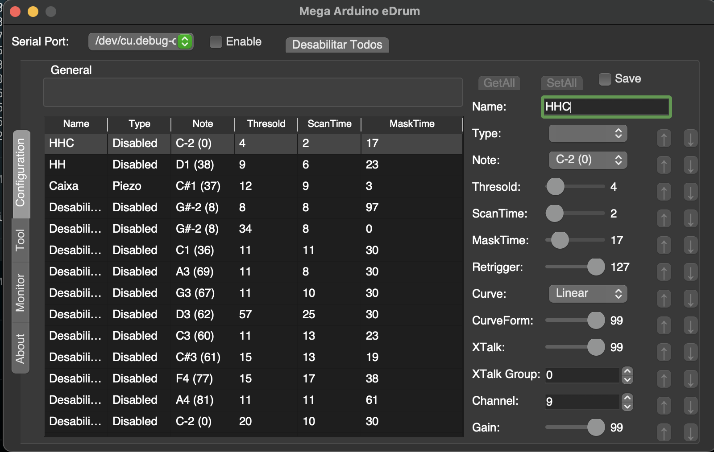
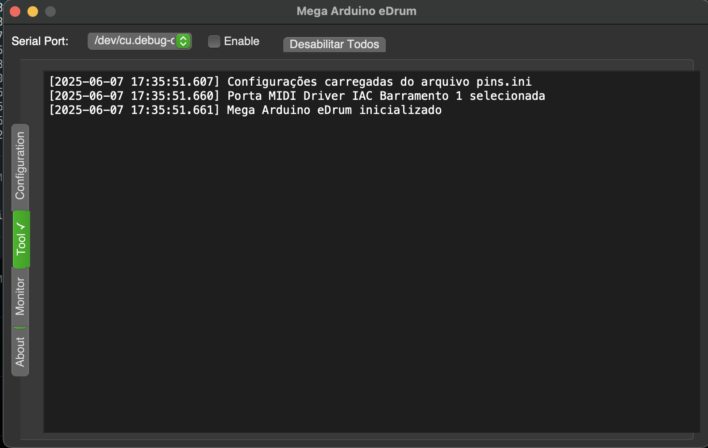
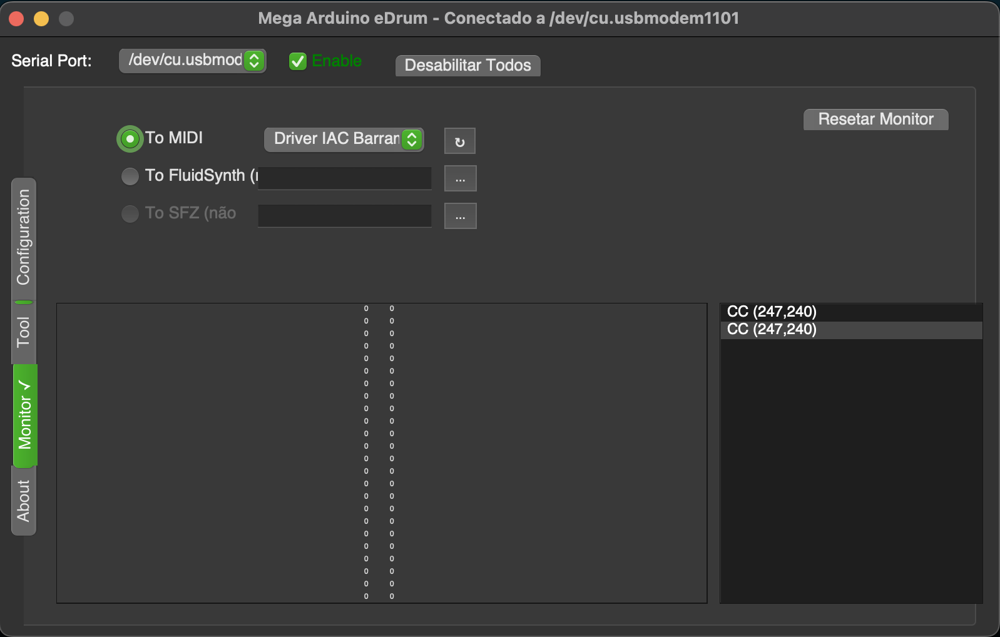

# Mega Arduino eDrum

Interface gráfica para configuração e uso de baterias eletrônicas baseadas em Arduino Mega.
<p align="center">
  
</p>

## Sobre o projeto

Este projeto é um fork melhorado do [md-python-config-tool](https://github.com/massimobernava/md-python-config-tool) originalmente criado por Massimo Bernava. Foi reescrito para ser compatível com Python 3 e PyQt5, além de incluir diversas melhorias funcionais.

## Melhorias implementadas

- Compatibilidade com Python 3 e PyQt5
- Interface gráfica melhorada e mais responsiva
- Suporte para sistemas operacionais modernos (Windows, macOS, Linux)
- Carregamento e salvamento automático de configurações
- Sincronização bidirecional com o Arduino (recebe e envia configurações)
- Botão para desabilitar todos os pinos de uma vez
- Tratamento de erros aprimorado
- Feedback visual para operações de longa duração (agora os campos de configuração tem tooltip explicando suas funções)
- Melhor organização do código e documentação
- Correção de bugs da versão original
- **Otimizações de latência** para resposta mais rápida dos pads
- Comunicação serial otimizada para baixa latência
- Log's em tempo real na aba "Tool" implementado (melhor depuração)

- Painel informativo de nota MIDi enviada na aba monitor


## Requisitos

- Python 3.6 ou superior
- PyQt5
- pyserial
- python-rtmidi
- psutil (opcional, para otimização de prioridade de thread)

## Instalação

1. Clone este repositório:
```
git clone https://github.com/seu-usuario/mega_arduino_edrum.git
cd mega_arduino_edrum
```

2. Instale as dependências:
```
pip install -r requirements.txt
```

Para usuários Windows, pode ser necessário instalar o Visual C++ Build Tools para compilar o python-rtmidi. Alternativamente, você pode usar:
```
pip install python-rtmidi --no-build-isolation
```

## Uso

Execute o programa principal:
```
python main.py
```

### Configuração básica:

1. Selecione a porta serial do Arduino Mega
2. Clique em "Enable" para conectar
3. Configure os parâmetros dos pads na aba "Configuration"
4. Use os botões de upload/download para enviar/receber configurações do Arduino

### Funcionalidades principais:

- **Desabilitar Todos**: Botão para definir todos os pinos como "Disabled"
- **GetAll**: Solicita todos os parâmetros do pin selecionado do Arduino
- **SetAll**: Envia todos os parâmetros do pin selecionado para o Arduino
- **Save**: Salva as configurações na EEPROM do Arduino

## Notas

- As funcionalidades relacionadas ao FluidSynth e SFZ não foram completamente testadas
- O arquivo de configuração pins.ini é salvo automaticamente e carregado na inicialização
- Para obter a menor latência possível, consulte o arquivo [PERFORMANCE.md](docs/PERFORMANCE.md)
- Configurações otimizadas da porta serial para reduzir latência

## Licença

Este projeto é distribuído sob a licença CC BY-NC-SA 3.0, a mesma do projeto original.

## Créditos

- Desenvolvimento original: Massimo Bernava
- Adaptação para Python 3 e melhorias: Evandro Grezeli